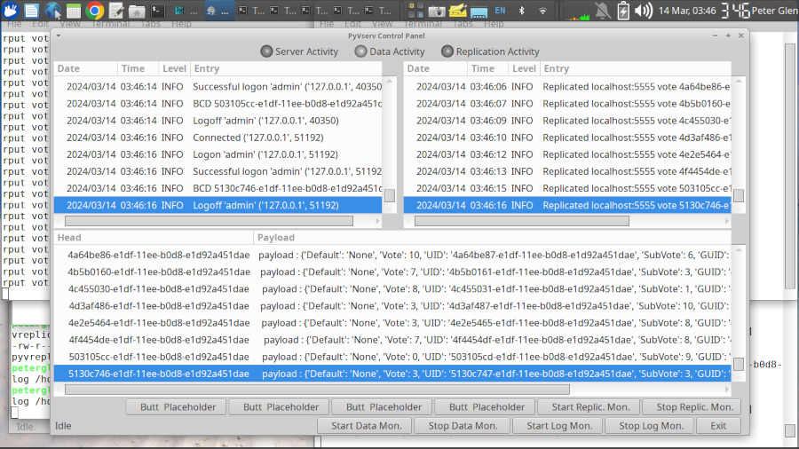
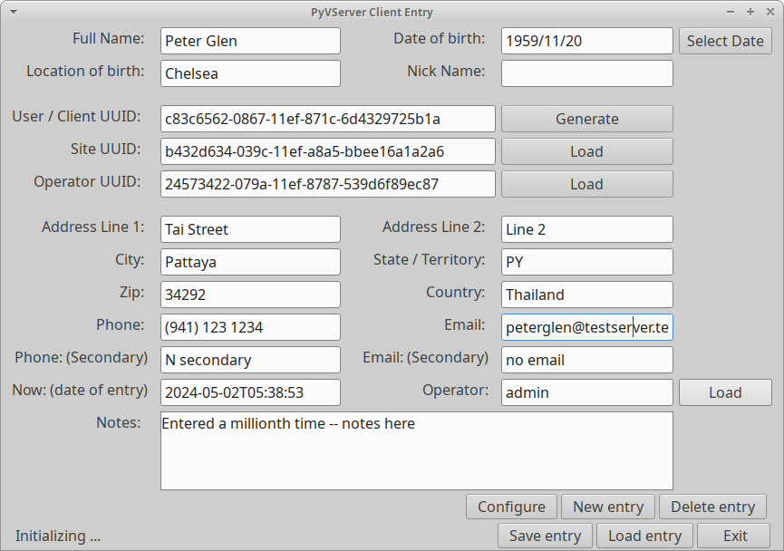
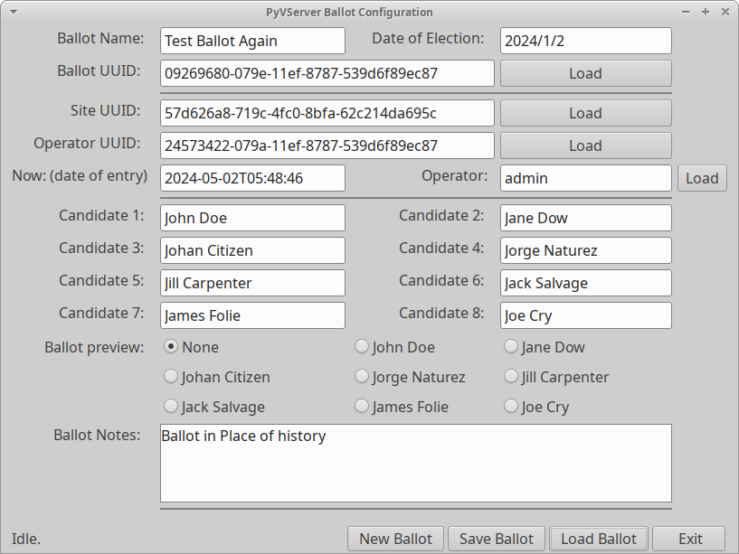
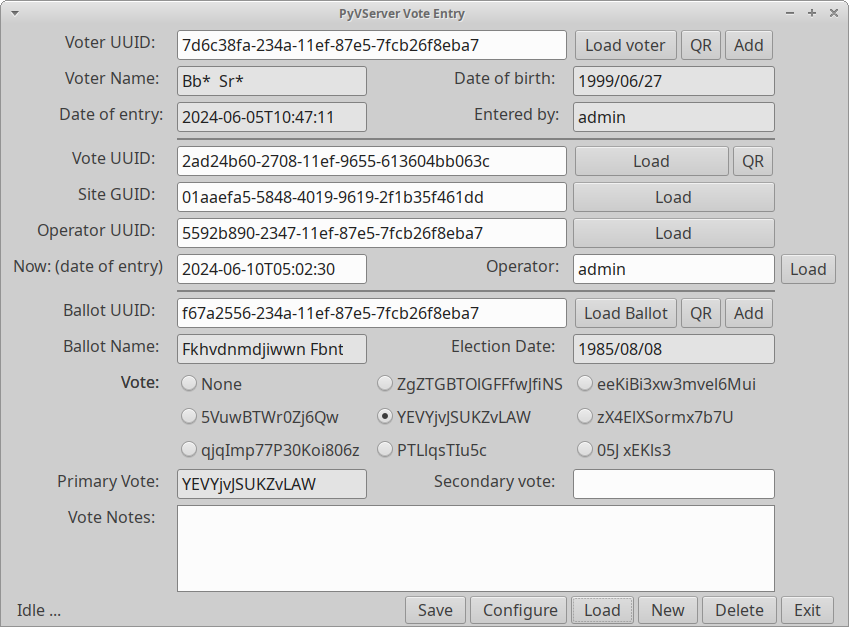
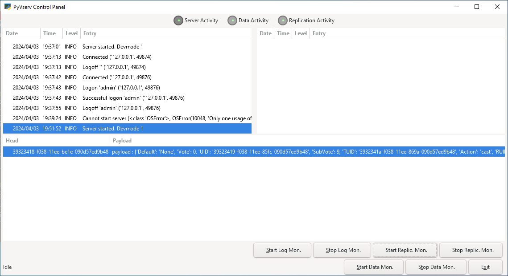
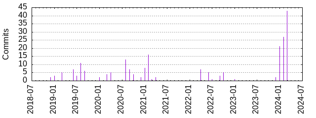

#  PyvServer

## 	Fully encrypted TCP/IP server.

 &nbsp; &nbsp; PyvServ is an encrypting TCP/IP server written in Python. The
encryption algorithm is AES. (Advanced Encryption Standard) The key exchange
uses ECC. (Elliptic curve) The server can be fully administered from the
protocol side.

## How to use, what it is for:

    Public Voting System Blockchain server.
    Charity administration, trust maintenance. (Zakat)
    Internal currency / resource maintenance.

#### Public Voting System Blockchain server.

  The system maintains an encrypted chain of vote events. Every entry has
(among others) the Voter ID, an Electronic ID, and the vote action (register / cast /
un-cast / withdraw), and of course, the vote.

  The voter ID is a number allocated by authorities, the Electronic ID is a
number allocated on initial login / registration / transaction by the system.
The Voter Block Chain, the associated IDs, and the vote is visible to the public,
so every voter can verify his / her participation. The voter ID is visible, but
the data behind it is known by the electorate only.

  The blockchain may be replicated to independent hosts, so falsifying it
would require breaching multiple services.

 The blockchain visibility allows that every voter can verify their participation.
This also allows all parties to verify the chain, and create independent counts.

 The chain can  be verified for legitimate and singular registration. This system
crates accountability from both the voter's side and the electorate (authority's) side.

#### Charity administration, trust maintenance. (Zakat)

 The blockchain will allow the donation's public visibility and the donation's
usage. It can accommodate arbitrary information, for instance: disbursement
target, fund source, funding entity ... etc. The system handles unique IDs
transparently, which allows privileged information to be encoded as a unique ID.
This unique ID than can be turned back to real information by the publisher
of the Unique ID, preserving privacy.

#### Internal resource / currency maintenance

 The blockchain will allow monitoring internal resource allocation / usage.

 &nbsp; &nbsp; PyvServ contains protocol level encryption, which can be switched on by
instructing the server to use an encryption (session) key.

 &nbsp; &nbsp; PyvServ contains a key exchange protocol, so the new session keys
can be transmitted securely. The key exchange is based on ECC.

 PyvServ has utilities to generate encryption keys. At least one
key needs to be generated before use. (now automatic) The server picks from
a pool of keys, so communication data is always distinctive. Make sure you
generate some new keys with the 'pyvgenkeys' utility before production
deployment.

 PyvServ has blockchain empowered back end. The new data is linked to the
previous record. Utilities to verify the data are also provided.
(dbaseadm and chainadm)

 PyvServ has file upload / download capabilities with encrypted transport.

 PyvServ has replication facilities via a client based 'I have You have'
 mechanism featuring encrypted transport. It is also capable of replication
 on a 'replicate when received' mechanism. The replicated records are marked
 with a replication count, so replication does not enter looping. By default,
 the replicated records are not replicated any further, assuming a flat
 structure of replication.

#### Installation:

    pip install pyvserv

 Newer Linux-es do not allow pip to modify the system, pyvserv may be installed
 with pipx, which separates the sever process into a virtual environment.

 Dependencies:

 Most linux systems already have all the dependencies by default. Some dependencies
 are added automatically on installation.

     pydbase, pyvpacker, pyvecc, pyvguicom

 The firewall needs to be opened for incoming connections on port NN

For example (assuming port 6666):

    sudo iptables -A INPUT -p tcp --dport 6666
    sudo iptables -A INPUT -p tcp --sport 6666

 Please note that this is not a recommendation, it is a port we used during
 development.

#### Start server

 The python server can be added to the system servers with the Makefile targets
'make genservice' and 'make instservice'
 The scripts will generate the service file to run under current user's
 credentials, and install it onto the running system. (requires sudo)

#### Platforms:

 This project was developed on Ubuntu 22.x. Most linux distributions should work.
It is ported to Windows MSYS2, with all major functions operating as expected.

 On Fedora, the service files need to be re-written to accomodate the
quirk that the Fedora systectl does not allow user executables.

One solution is to install the 'pip pyvserv' as root, and adjust the service
file accordingly. If you want to use pyvserv with particular data directory,
use the -r option.

On Debian and newer Ubuntu-s (23+) the system needs the --break-system-packages
option on pip. If that is not desired, one may create a venv for pyvserv.
This is a cautionary arrangement for the OS, pyvserv does not break anything.
The other solution is to use pipx.

    pip install pyvserv --break-system-packages

or ..

    pipx install pyvserv

pip installs the scripts in ~/.local/bin, so add the following line
  to the end of ~/.bashrc:

    PATH=$PATH:~/.local/bin

This workaround is not needed if one installs pyvserv in a virtual environment.

    python3 -m venv pip_pyvserv
    cd pip_pyvserv
    source ./bin/avtivate
    pip install pyvserv
    ... continue as needed.

 The makefile target 'make installvirt' will install pyvserv in a virtual
environment.

  Running pyvserv as a system daemon from virtual environment needs extra
configuration steps. You may use the make target: 'make genservice_virt'
and activate with 'make instservice'
Please see the relevant systemctl manuals.

#### Quick map:

    Server.     subdir: pyvserver       -- Server has most all the commands
    Client.     subdir: pyvclient       -- Exercise server commands / demo code
    Test Suite. subdir: pyvclient/tests -- official pytest tests
    Tool Suite. subdir: pyvtools        -- Key generation ... etc
    GUI base    subdir: pyvgui          -- Monitoring / Administering the server
    Studies.    subdir: study           -- Testing/learning subsystems (ignore it)

#### Quick start:

 One can mimic global connectivity on a single machine. This would allow the study
of the client / server interaction before live deployment. This chapter assumes
installation / clone from github, replicating directory structure on the
local drive.

    open terminal window
    navigate to the server's pyvserver subdir
    type: ./pyvserv.py

    open another terminal window
    navigate to the pyvclient subdir
    type: ./pyvcli_hello.py

The following (and more) should be printed on the command line:

    ./pyvcli_hello.py

    Server initial: ['OK', 'pyvserv 1.0.4 ready']
    resp ['OK', 'Hello', '4814b46a-9489-4720-af7d-aa14ba19f2be', '11367']
    Server quit response: ['OK', 'Bye', '11367']

Quick rundown of the above test:

    1.) Server responds to connection with signin message
    2.) Delivers OK status, hello message, server serial number, and a unique id
    3.) Server signs off. Repeats unique id / session number.

This interaction is typical of all the commands.

The unique ID is the session's thread ID and it is not meant to be used other than
identifying the session on the client side.

 The best way to learn about the operation of the server is to look at the
sample client examples in the client source tree. (Files named pyvcli_*)

## The pip install

Scripts are provided for the server, and some test clients. The
server can be started as

    pyvserver

 The -P option is for non Developer mode, enabling 2FA authentication.
(two factor authentication)

The command line client can be started as:

    pyvcli_cli

  In the command line client most of the server functions can be exercised.
See the pyvcli_* utils for more examples of driving the server. On a
fresh install, one may need to execute the pyvcli_uini.py to create an initial
admin user, with password 1234. The uini command will prompt if this is
what was intended.

 The cli utility command 'help' will deliver information on the available commands.

!!! IMPORTANT !!! Make sure you change this when testing / learning is over.

## Command line help

    Usage: pyvserv.py [options]

    Options:
            -n   --host                 -  Set server hostname / interface.
            -r   --dataroot  dataroot   -  Set data root for server.
            -P   --pmode                -  Production mode ON. (allow 2FA)
            -l   --loglevel             -  Log level (0 - 10) default = 1
            -m   --mem                  -  Show memory trace.
            -N   --norepl               -  No replication. (for testing)
            -d   --debug     debug      -  Debug level 0-10
            -p   --port      port       -  Listen on port
            -v   --verbose              -  Verbose
            -q   --quiet                -  Quiet
            -V   --version              -  Print Version
            -h   --help                 -  Show Help

## Client command line help example:

 While most command line clients have their own help screen, here as a typical
client utility's help screen:

    Usage: pyvcli_uman.py [options] [hostname]

    Options:    -d level  - Debug level 0-10
                -p        - Port to use (default: 6666)
                -l login  - Login Name; default: 'user'
                -s lpass  - Login Pass; default: '1234'
                -u user   - User Name; default: 'user'
                -t        - prompt for login pass
                -a        - Add user. Must be a unique user name.
                -r        - Remove user
                -u user   - User Name; default: 'user'
                -p pass   - User password; default: '1234' (!!for tests only!!)
                -T        - prompt for new pass
                -m        - Add admin instead of regular user
                -e enflag - Enable / Disable user.
                -i kind   - List users (user or admin
                -v        - Verbose
                -q        - Quiet
                -h        - Help

     One of Add / Remove / Enable / List option is needed.

## pyvser clients

 Some client programs are supplied to administer / drive / monitor pyvserv.
 The -h option on the client programs give a brief help of usage / purpose.

 | Client name  | Description               |        Purpose                |
 | -----------  |  -----------              |  ------------------------     |
 | pyvcli_cli   | Command line interface    | All aspects of pyvserv        |
 | pyvcli_uini  | Create initial user       | Create initial admin user     |
 | pyvcli_fman  | File manager              | Upload / Download files       |
 | pyvcli_uman  | User manager              | Add remove users / admins     |
 | pyvcli_rman  | Record manager            | Get / Put Blockchain Records  |
 | pyvcli_hello | Get hello message         | Connectivity test             |
 | pyvcli_ver   | Get Version number        | Check for server version      |

 The utilities can also be executed from the 'pyvclient' sub directory by
 post fixing with script extension. (add the .py extension like: ./pyvcli_cli.py)

 The date formats for specifying record date filter dates are:

   'Y-m-d+H:M' 'Y-m-d' 'm-d' 'm-d+H-M'

Where Y=year m=month d=day H=hour M=minutes, just like in strftime.
The hour is in 24 hour notation.

The following are all valid dates specs, specifying the same date
(in 2024 apr 15 at 00:00):

    '2024-04-15' '2024-04-15+0:0' '04-15 04-15+00:00'

## Testing:

   All pytest cases pass successfully. Note that for the pytest client
tests one needs to start the server. ('./pyvserv.py' or pyvserv if installed)
The server --port and --dataroot option can be used to start the server in
an alternate 'universe', so it does not interfere with production.

    ============================ test session starts ==============================
    platform linux -- Python 3.10.12, pytest-7.4.3, pluggy-1.0.0
    rootdir: /home/<homedir>/pgpygtk/pyvserv
    collected 15 items

    test_afirst.py .                                                         [  6%]
    test_file.py ..                                                          [ 20%]
    test_hello.py .                                                          [ 26%]
    test_help.py .                                                           [ 33%]
    test_id.py .                                                             [ 40%]
    test_key.py .                                                            [ 46%]
    test_login.py .                                                          [ 53%]
    test_noadmn.py .                                                         [ 60%]
    test_rget.py .                                                           [ 66%]
    test_rput.py .                                                           [ 73%]
    test_sess.py ..                                                          [ 86%]
    test_user.py .                                                           [ 93%]
    test_ver.py .                                                            [100%]

    ============================== 15 passed in 9.47s ==============================

Additional tests can be found in the tests/ directory. The pyvcli_* files in the
'pyvclient' directory may also serve as test cases.

## Production:

Once the testing phase is complete, deploying it for production needs a
complete wipe of the data. There are Makefile targets that do that
(make cleanall). Restarting the server will create the new environment without
any users. To allow operation one may create the initial user with the pyvcli_uini
functions and / or scripts. Make sure you create strong passwords.
The uini command can only operate successfully if there are no users present in the
pyvserv system, and it is executed from the loopback interface. For example,
the command line utility ./pyvcli_uini.py can be used;
For production, uini should executed with the -t option to prompt for a password.

## Screen shots:

 Following, a set of screen shots to demonstrate the sub systems from entering
voter data, casting votes, monitoring vote servers, watching vote tallies.

### Screen shot of the Monitoring tool:

 This screen shot depicts the monitoring (control panel) application 'pyvcpanel'.
The top left area contains a live view of the pyvserver syslog. The top right
contains a live view of the replicator log.

 The bottom area of the window contains a live view of the incoming data, as it is
originally formatted, without the blockchain and hash details.

  All views monitor the live log files, on the default setup. The montor functions
operate, without interfering with any of the operations.

### Screen shot of the Voter Entry tool:

The UUID fields serve identification of the voter, the organization hosting
the record entry, and the operator that entered this record.

### Screen shot of the Ballot Editing tool:

The UUID fields serve identification of the ballot, the organization hosting
the ballot entry, and the operator that entered this record.

### Screen shot of the Vote Casting tool:

The vote choices are presented in random order, as recent studies show the
order influences the voting process.
The UUID fields serve identification of the vote, the organization hosting
the ballot entry, and the operator that entered this record.

## Windows compatibility

  Pyvserv now functions in the Windows MSYS2 subsystem. All the major
functionalities are ported. The file locking mechanism works, and all the
pytests pass. Naturally, logging and readline etc ... works with the usual
windows caveat.

  For the GUI functions ona my need to install the PyGobject subsystem.
Instructions can be found very easily for that.

Below, a screenshot of the pyvserv control panel in MSYS2.

The project is functional in MSYS2, but for real deployment we recommend Linux.

## History:

 Recent history kept, for the full list of changes consult the github site.

    1.0.0   Sun 03.Mar.2024    Beta ready
    1.0.0   Mon 11.Mar.2024    PIP installation with utils
    1.0.0   Wed 13.Mar.2024    rget rput and family (rget=BC record get)
    1.0.0   Thu 14.Mar.2024    Started GUI tools
    1.0.1   Fri 15.Mar.2024    Added LIC, verification, doc, tally
    1.0.3   Wed 03.Apr.2024    Ported to MSYS2, throttle, for multiprocess
    1.0.4   Tue 09.Apr.2024    Cleanup, uman fman rman completed
    1.0.4   Mon 06.May.2024    Progress on vote tools

## Statistics

    Project name
        pyvserv
    Generated
        2024-04-09 20:45:56
    Report Period
        2018-12-31 20:50:04 to 2024-04-09 20:41:24
    Age
        1927 days, 111 active days (5.76%)
    Total Files
        211
    Total Lines of Code
        44443 (258657 added, 214214 removed)
    Total Commits
        257 (average 2.3 commits per active day, 0.1 per all days)
    Authors
        6 (average 42.8 commits per author)

## Security review:

 &nbsp;  As of today, (Fri 15.Mar.2024) the 256 bit AES is considered unbreakable by
available state of the art means. The key exchange algorithm ECC 384 bit is
also considered safe. These algorithms are used dynamically, as a randomly picked
key is used in every session. The session is also able to dynamically change keys
mid flight, on command.

 &nbsp; The checksum verification and link verification both use SHA256 (256 bit)
hashes. This is generated every time a transaction is created.

 &nbsp; The proof of work is a modest 3 generations deep. This can be calculated
with an everyday desktop in one ... to ... three seconds. Even though this looks like
a small amount, it adds up if one wants to re-generate (fake) a whole chain.
Additionally, the check sum, the link sum, and proof of work interact, changing one
will effect the other. This way a sum verification and link verification and the
proof of work verification together create an ironclad safety solution.

Written by Peter Glen, 2022, 2023, 2024
Released under MIT License (MIT)

// EOF
